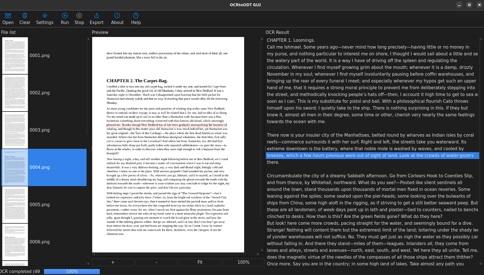
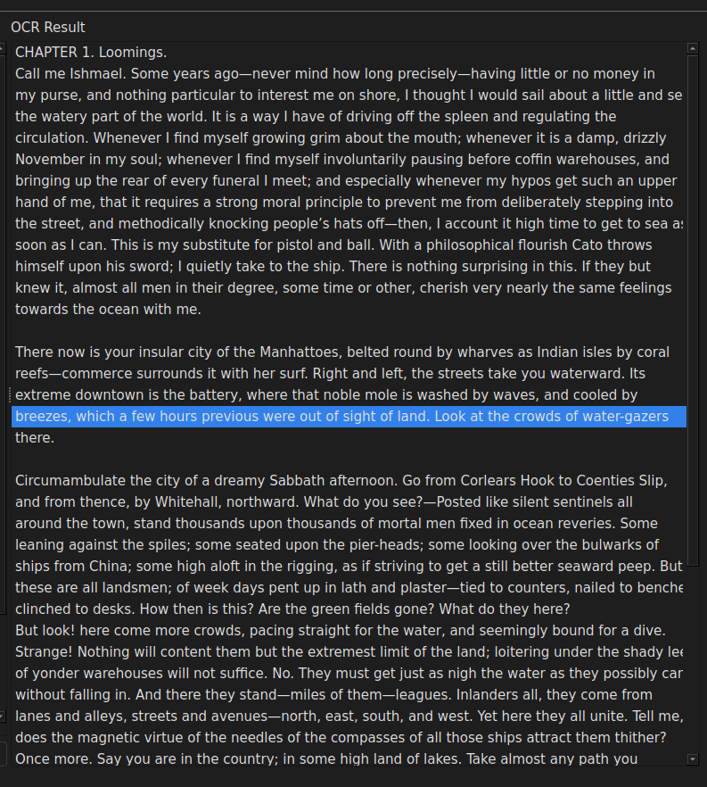
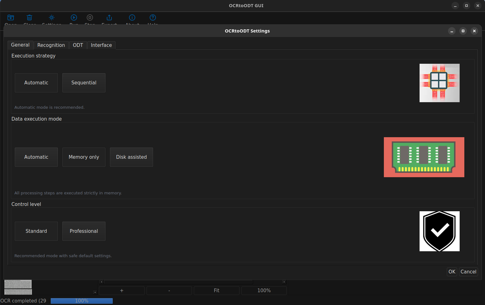
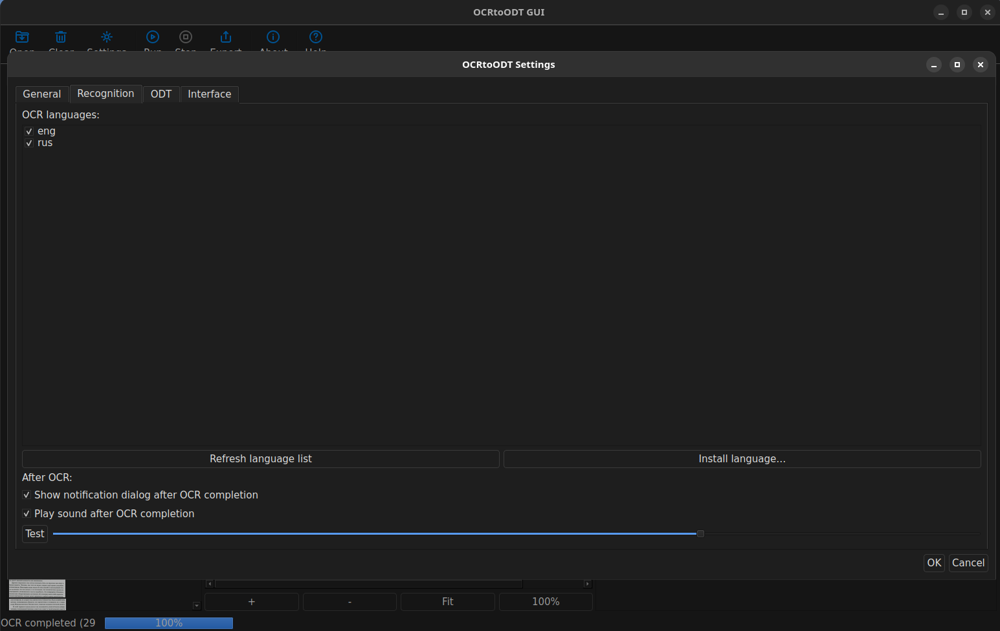
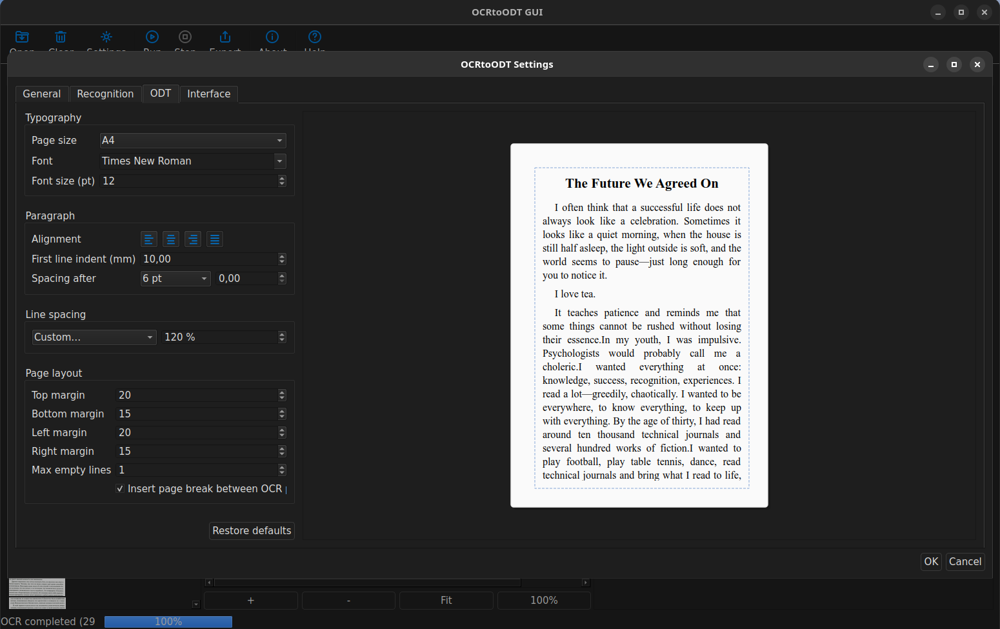
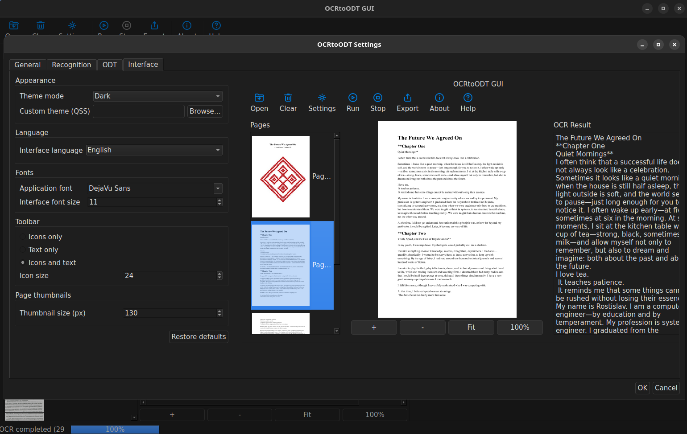

# 🧠 OCRtoODT

## Structured OCR Extraction & Deterministic Processing Engine

## 📌 Overview

**OCRtoODT** is a professional-grade structured OCR extraction system built in modern **C++ (Qt 6)**.

It is **not** a text editor.  
It is **not** a word processor.

It is a **deterministic, inspectable OCR data pipeline** designed for:

- archival digitization
- research workflows
- legal and academic OCR
- structured document processing
- reproducible OCR experiments

The focus is on:

- structural correctness
- predictable multi-stage processing
- RAM-first execution
- full traceability

---

# 🎯 Philosophy

**Structure first. Formatting later.**

OCRtoODT preserves raw OCR results and transforms them into structured representations **without hidden modifications**.

The application guarantees:

- deterministic pipeline execution
- no silent post-processing distortion
- explicit configuration control
- isolated stage responsibilities

---

# 🏗 Processing Pipeline

OCRtoODT is built as a strict **stage-based engine**:

- STEP 0 → Input
- STEP 1 → Preprocess
- STEP 2 → OCR
- STEP 3 → TSV Structuring
- STEP 4 → UI Synchronization
- STEP 5 → Export


Each stage:

- has a defined contract
- produces predictable output
- does not access UI logic
- avoids ownership violations

---

## 🔹 STEP 0 — Input

- PDF loading (Poppler-Qt6)
- Raster image import (PNG, JPEG, TIFF)
- Page expansion
- Thumbnail generation
- VirtualPage construction

---

## 🔹 STEP 1 — Preprocessing

OpenCV-based pipeline:

- grayscale normalization
- adaptive thresholding (Sauvola)
- CLAHE
- shadow removal
- sharpening

Processing is **threaded and resource-aware**.

---

## 🔹 STEP 2 — OCR

- Embedded **Tesseract**
- Multi-pass PSM execution
- Quality scoring
- Best-pass selection
- RAM-first TSV handling
- Cooperative cancellation

Tesseract is bundled inside the project:


thirdparty/tesseract/
thirdparty/tessdata/


No external system Tesseract installation is required.

---

## 🔹 STEP 3 — TSV Structuring

- TSV → LineTable conversion
- Structural line grouping
- RAM-first processing
- Optional debug disk persistence

---

## 🔹 STEP 4 — UI Synchronization

- Preview ↔ Text mapping
- Line highlighting
- Structured inspection

The UI **never performs OCR logic**.

---

## 🔹 STEP 5 — Export

- ODT export
- TXT export
- Structured document generation

---

# 🧱 Core Data Model

## Core::VirtualPage

Central pipeline object.

Contains:

- source metadata
- OCR TSV text
- OCR success flag
- structured `LineTable`
- layout extensions (future-ready)

It acts as the **single source of truth** across all pipeline stages.

---

# ⚙ Execution Model

## RAM-First Design

Primary storage: **memory**  
Disk usage: **optional and policy-driven**

Supported modes:

- `ram_only`
- `disk_only`
- `debug_mode`

### Configured via:
config.yaml


---

# 📊 Progress System

Centralized **ProgressManager** provides:

- stage-aware progress tracking
- global percentage
- ETA estimation
- cancellation-safe reset
- deterministic finish handling

---

# 🧾 Logging System

**LogRouter**

Features:

- canonical log levels (0–4)
- runtime verbosity control
- file + console routing
- profiling-ready architecture

Designed for **auditability and diagnostics**.

---

# 🖥 Graphical Interface

Built with **Qt 6 Widgets**.

### Main UI Areas

- 📂 Input panel (files + thumbnails)
- 🖼 Preview panel (zoom, fit, highlight)
- 📑 Structured text panel
- ⚙ Settings dialog
- 📤 Export dialog

The UI is **inspection-focused**, not editing-focused.

---

# 🖼 Screenshots

### Main Window

<p align="left">
  
</p>

### Structured Text View

<p align="left">
  
</p>

### Settings — General

<p align="left">
  
</p>

### Settings — Recognition

<p align="left">
  
</p>

### Settings — ODT

<p align="left">
  
</p>

### Settings — Interface

<p align="left">
  
</p>

---

# 🗂 Repository Structure


src/
├── 0_input/
├── 1_preprocess/
├── 2_ocr/
├── 3_LineTextBuilder/
├── 4_edit_lines/
├── 5_export/
├── 5_document/
└── core/

dialogs/
settings/
systeminfo/

thirdparty/
├── tesseract/
└── tessdata/

resources/


The structure is **modular and stage-aligned**.

---

# 🔧 Build Instructions

## Requirements

- C++17 compatible compiler
- Qt 6 (Core, Widgets, Concurrent, Multimedia)
- OpenCV
- Poppler-Qt6
- CMake ≥ 3.16

---

## 📦 Generic Build

```bash
git clone https://github.com/Rostislav62/OCRtoODT-Qt
cd OCRtoODT

mkdir build
cd build

cmake ..
cmake --build . -j
```
---
Run:
``` ./OCRtoODT ```

---

## 🪟 Windows Build (Conceptual)

- Install Qt 6 (MSVC)
- Install OpenCV
- Install Poppler-Qt6
- Use Qt Creator or CMake + MSVC
- Ensure the runtime DLLs are available

---
## 🧪 Configuration
All runtime behavior is controlled via:
config.yaml

---
## Features:
- hierarchical structure
- comment-preserving parser
- safe runtime reload

Example:

general:
  mode: ram_only
  debug_mode: false

ocr:
  languages: eng
  psm_1: 4
  psm_2: 6

ui:
  theme_mode: dark
  thumbnail_size: 160
  
---
## 🧠 Technical Stack
Component	    Technology 
Language	    C++17 
GUI	            Qt 6 
OCR	            Embedded Tesseract
Image Processin     OpenCV
PDF Handling	    Poppler-Qt6
Concurrency	    QtConcurrent
Config	            Custom YAML (comment-preserving)
Platforms	    Linux / Windows 

---
## 🚧 Roadmap

Planned directions:
- advanced paragraph recovery
- column detection improvements
- footnote handling
- layout reconstruction
- packaging (AppImage / Windows bundle)
- performance profiling dashboard

---
## 👨‍💻 Author
Rostislav Smigliuc

GitHub:
https://github.com/Rostislav62/

## 📜 License

MIT License
